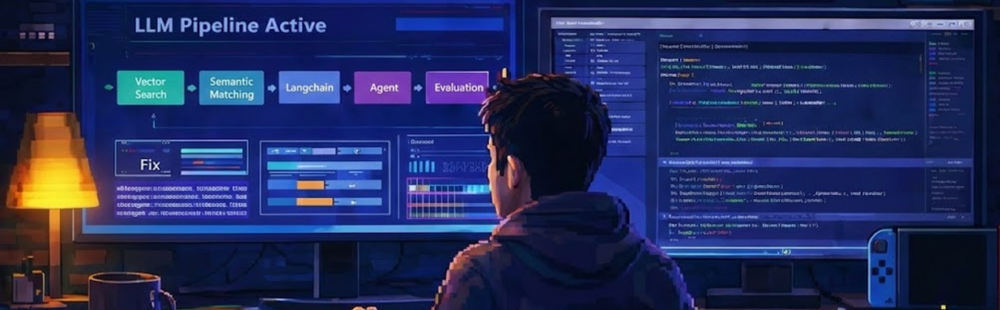

<div align="center">

<!-- BANNER — upload your image as 'banner.png' in your umangGG1 repo -->


<br/>

### hey, i'm umang 👋

**`AI Developer @ RaisnAI`** · **`IIT Roorkee '27`**

i build LLM agents, RAG pipelines, and eval systems — then make sure they actually work in prod.

<br/>

[](https://linkedin.com/in/umang-singh-752111156)
[](mailto:umang10424@gmail.com)
[](https://github.com/umangGG1)

</div>

---

```python
class Umang:
    def __init__(self):
        self.role      = "AI Developer @ RaisnAI"
        self.edu       = "B.Tech + M.Tech @ IIT Roorkee"
        self.building  = ["multi-agent systems", "RAG pipelines", "LLM eval frameworks"]
        self.prev      = ["Renaiscent AI", "OpGuru"]
        
    def currently(self):
        return {
            "🔬": "agent evaluation pipelines — open-source alternative to ClearLabs.ai",
            "🏥": "healthcare EMR with AI-powered nurse query system",
            "🎯": "hybrid retrieval engines (semantic + keyword search)",
            "📄": "AI resume editor with JD-matching & ATS optimization"
        }
    
    def philosophy(self):
        return "if you can't eval it, don't ship it"
```

---

<h3 align="center">⚡ tech stack</h3>

<div align="center">

| **AI / LLM** | **Data / Infra** | **Dev / Ship** |
|:---:|:---:|:---:|
|    |    |    |
|    |    |    |

</div>

---

<h3 align="center">🚀 what i've been shipping</h3>

<div align="center">
<table>
<tr>
<td width="50%" valign="top">

<h4>🧪 Agent Eval Pipeline</h4>

End-to-end generation → evaluation pipeline for airline SaaS. Uses **Ragas + DeepEval + Qwen-2B** as judge. Open-source alternative to ClearLabs.ai.

`ragas` `deepeval` `qwen` `langchain`

</td>
<td width="50%" valign="top">

<h4>🏥 Nerula Health EMR</h4>

Healthcare platform with AI query system for nurses. **500+ users, 99.9% uptime**, MistralAI integration, 100% PHI compliant.

`fastapi` `react` `mongodb` `mistral`

</td>
</tr>
<tr>
<td width="50%" valign="top">

<h4>🎯 OpGuru RAG Engine</h4>

Hybrid retrieval (semantic + keyword) matching **500+ profiles** to career opportunities. Multi-stage pipeline with vector DB search.

`pinecone` `langchain` `openai` `react`

</td>
<td width="50%" valign="top">

<h4>📄 AI Resume Editor</h4>

JD-matching engine with Mistral. **90% parsing accuracy**, ATS score improvement by 40%. Semantic section extraction + prompt-based editing.

`mistral` `nlp` `react` `node`

</td>
</tr>
</table>
</div>

---

<h3 align="center">📊 github stats</h3>

<div align="center">


<br/>


</div>

---

<div align="center">


<br/><br/>

*"ship fast. eval faster. sleep... eventually."*

</div>
